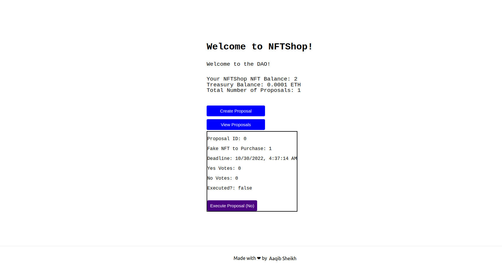

# NFTShop DAO
# NFTShop where you can buy NFT

A DAO is a decentralized autonomous organization, a type of bottom-up entity structure with no central authority. Members of a DAO own tokens of the DAO, and members can vote on initiatives for the entity.

[Demo](https://nftshop-dao.vercel.app/)

